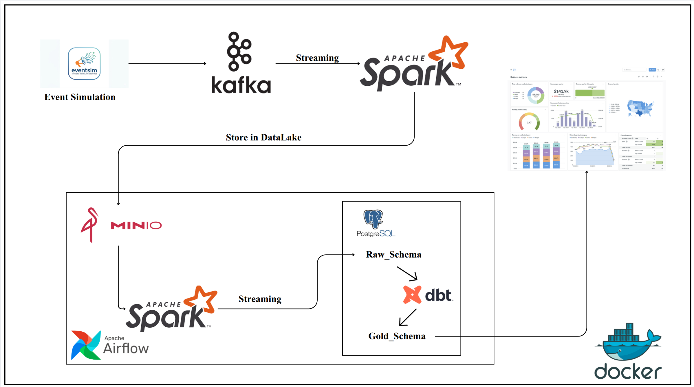

# Music Streaming Data Pipeline

## Architecture

## Description
This project is inspired by the [Streamify](https://github.com/ankurchavda/streamify), which demonstrates a real-time data engineering pipeline for analyzing music streaming events. In this work, we redesign the architecture so that the entire system can run **fully on a local machine using Docker**. This allows users to easily experiment with technologies such as Kafka, Spark, Airflow, dbt, MinIO, and PostgreSQL without relying on cloud infrastructure.

